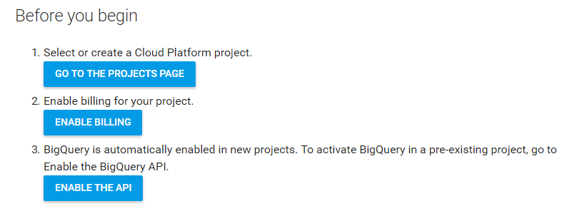
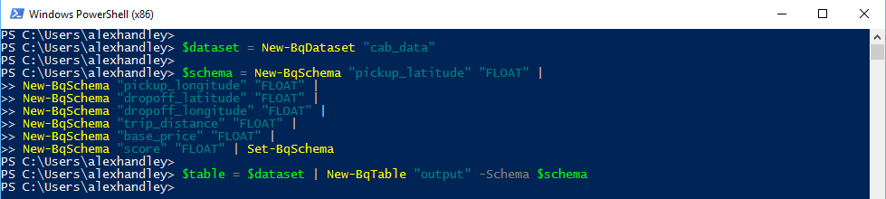
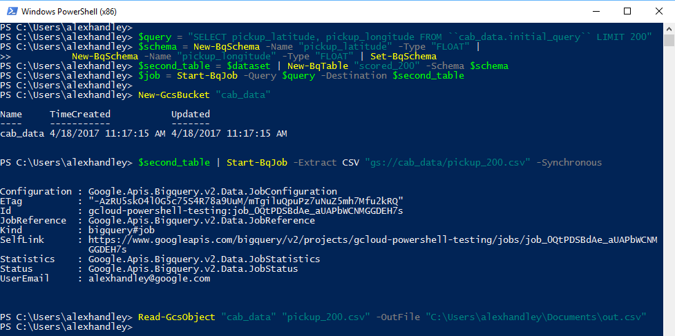
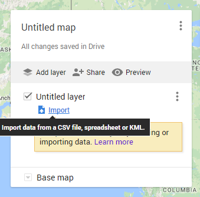
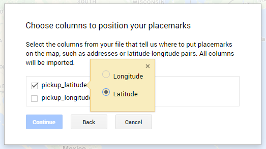
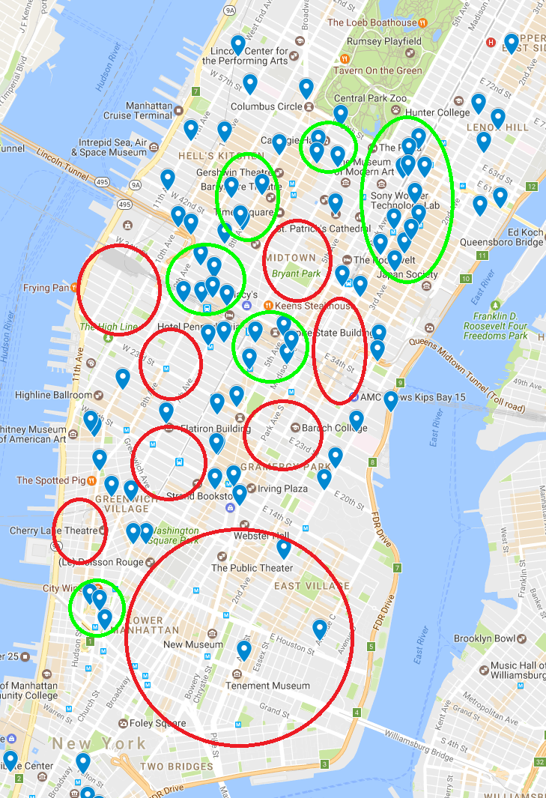

# BigQuery on PowerShell Demo
##### Author: Alex Handley, SWE Intern

[Google BigQuery](https://cloud.google.com/bigquery/) is a versatile tool that solves the problem of storing and querying massive datasets without having to worry about data formats, underlying resources, and other things that distract you from the analysis at hand. To help those BigQuery users who virtually live in Microsoft PowerShell, I’ve written a set of PowerShell cmdlets for BigQuery--allowing them to script BigQuery commands straight from the PowerShell environment that they know and love.  

In this post, I’ll demonstrate how to use these cmdlets. The demo is based is on a public [BigQuery dataset](https://cloud.google.com/bigquery/public-data/), so it’s easy to follow along.


## Project setup
Before you begin, if you already have a Google Cloud project, skip to **BigQuery Setup**:

Go to the [Cloud Quickstart](https://cloud.google.com/bigquery/quickstart-web-ui) page and follow the “Before you begin” steps.



Set your project as the default project for powershell.

```
gcloud config set project "your-project-name"
```

Import the Cloud Tools for PowerShell module using [the steps listed on the GitHub repo](https://github.com/GoogleCloudPlatform/google-cloud-powershell#installation).

## BigQuery setup
The BigQuery dataset with historical information about cab rides is an interesting playground for data analysis. This table contains pickup and dropoff locations, timestamps, fare information and other assorted metadata from New York City yellow cab rides from 2009 or later. We'll use that data, combined with BigQuery, to identify the best places for drivers who want to maximize their profit.  

The next few steps will be setting up some of the data structures that we need for this demo. First, make a new dataset in your project.

```
$dataset = New-BqDataset "cab_data"
```

Now that you have a dataset, you need to make a schema for the following fields so that you only include relevant information: pickup_latitude, pickup_longitude, dropoff_latitude, dropoff_longitude, trip_distance, base_price, score.

```
$schema = New-BqSchema "pickup_latitude" "FLOAT" | New-BqSchema "pickup_longitude" "FLOAT" |
	New-BqSchema "dropoff_latitude" "FLOAT" | New-BqSchema "dropoff_longitude" "FLOAT" |
	New-BqSchema "trip_distance" "FLOAT" | New-BqSchema "base_price" "FLOAT" |
	New-BqSchema "score" "FLOAT" | Set-BqSchema
```

Make a new table with the schema and dataset created above.

```
$table = $dataset | New-BqTable "output" -Schema $schema
```




## Running queries
Now you can start the actual data analysis. 

Run a query that scores each trip based on the simple metric of total ride price divided by the distance traveled. The query should pull a number of additional fields and save them to a destination table. This step allows you to make subsequent queries into the curated subset of data with ease, reducing the amount of data processed from ~50GB to ~15MB per query. 

Note below that the dataset name is in double backticks: The first one is to denote that the contents are a fully qualified BigQuery table, and the second one is to escape that character in PowerShell.

```
$query = "SELECT pickup_latitude, pickup_longitude, dropoff_latitude, dropoff_longitude, trip_distance, (total_amount - tip_amount) AS base_price, (total_amount / trip_distance) AS score FROM ``nyc-tlc.yellow.trips`` WHERE pickup_longitude != 0 AND total_amount < 1000 AND trip_distance > 1 ORDER BY score DESC LIMIT 1000"

$job = Start-BqJob -Query $query -Destination $table
```


Run another query on the initial results table to list just latitude and longitude of top-200 scoring records.

```
$query = "SELECT pickup_latitude, pickup_longitude FROM ``cab_data.initial_query`` LIMIT 200"

$second_table = $dataset | New-BqTable "scored_200"

$job = Start-BqJob -Query $query -Destination $second_table
```

Export the query results as a CSV file to Google Cloud Storage.

```
$bucket = New-GcsBucket "cab_data"

$second_table | Start-BqJob -Extract CSV "gs://cab_data/pickup_200.csv" -Synchronous
```

Download the CSV file using the Cloud Storage cmdlets.

```
Read-GcsObject "cab_data" "pickup_200.csv" -OutFile "C:\Users\alexhandley\Documents\out.csv"
```




# Mapping and analysis
Now that you have a table with just the refined coordinate data, you can [plot it on a custom Google Map](https://www.google.com/maps/d/u/0/). Create a new map and import your locations from the CSV file. Follow the dialogue box prompts on the site to import the file and select latitude and longitude columns. When asked for a column of names, just select either one because you don’t need the points to be named.
  





And there you have it! Scroll toward New York City to focus in the center of the mass of dots. Observe the locations plotted on the map, and identify clusters and holes. The green regions are clusters of high scoring trips, which means short and high-value rides. Drivers should stay in these areas to get the best trips and away from the red regions, which have a much smaller projected yield.




# Repetition and cleanup
You can repeat this process for any other metrics or queries using the same steps. In between queries, be sure to delete the second table using:

```
$second_table | Remove-BqTable -Force
```

When you’re finished, clean up the BigQuery dataset and the Cloud Storage bucket to avoid unnecessary charges.

```
$dataset | Remove-BqDataset -Force

Remove-GcsBucket "cab_data"
```


# Next steps
I’ve just shown you how to use BigQuery within PowerShell, and there’s an entire universe of data that can be analyzed. To get started on your own analytics projects:

* Install the BigQuery cmdlets from the [GitHub repo](https://github.com/GoogleCloudPlatform/google-cloud-powershell). 
* Review the [cmdlet docs](http://googlecloudplatform.github.io/google-cloud-powershell/#/).  
* For more on BigQuery itself, see the [official product page](https://cloud.google.com/bigquery/docs/).

